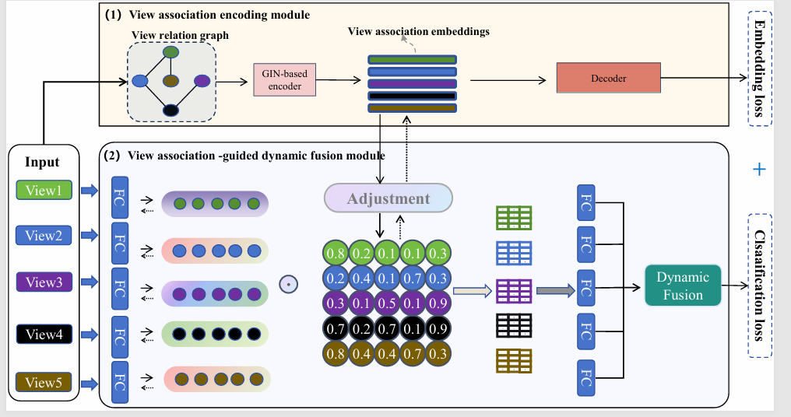

_**This paper has been accepted to IJCAI 2025**_

<h2 align="center"> <a href="https://www.ijcai.org/proceedings/2025/632">View-Association-Guided Dynamic Multi-View Classification</a></h2>

<div align="center">

**[Xinyan Liang<sup>1</sup>](https://xinyanliang.github.io/), [Li Lv<sup>1</sup>](https://github.com/LiShuailzn), _Qian Guo_<sup>2</sup>, _Bingbing Jiang_<sup>3</sup>, _Feijiang Li_<sup>1</sup>, _Liang Du_<sup>1</sup>, _Lu Chen_<sup>1</sup>**

<sup>1</sup>Institute of Big Data Science and Industry, Key Laboratory of Evolutionary Science Intelligence of
Shanxi Province, Shanxi University,<br>
<sup>2</sup>Shanxi Key Laboratory of Big Data Analysis and Parallel Computing, School of Computer Science and
Technology, Taiyuan University of Science and Technology<br>
<sup>3</sup>School of Information Science and Technology, Hangzhou Normal University, Hangzhou<br>


</div>


## Abstract
In multi-view classification tasks, integrating information from multiple views effectively is crucial for improving model performance. However, most existing methods fail to fully leverage the complex relationships between views, often treating them independently or using static fusion strategies. In this paper, we propose a View-Association-Guided Dynamic Multi-View Classification method (AssoDMVC) to address these limitations. Our approach dynamically models and incorporates the relationships between different views during the classification process. Specifically, we introduce a view-association-guided mechanism that captures the dependencies and interactions between views, allowing for more flexible and adaptive feature fusion. This dynamic fusion strategy ensures that each view contributes optimally based on its contextual relevance and the inter-view relationships. Extensive experiments on multiple benchmark datasets demonstrate that our method outperforms traditional multi-view classification techniques, offering a more robust and efficient solution for tasks involving complex multi-view data.

## 🏗️Model
<div align="center">
  
</div>
## 🎞️Experiment

### Data
We used multi-view datasets in this experiment:

| Datasets            | Dataset URL                                            |    Password      | 
|---------------------|--------------------------------------------------------|------------------|
| MVoxCeleb           | [link](https://pan.baidu.com/s/1k6DN1m64bnrRfLK8RiFmqQ)|     ls12         |
| YoutubeFace         | [link](https://pan.baidu.com/s/1SVTWfHpAUdFWwiU5o-kD7Q)|     ls34         | 
| NUS-WIDE-128 (NUS)  | [link](https://pan.baidu.com/s/1udO5jvolHIbd8lOV3w4SYA)|     ls56         | 
| Reuters5            | [link](https://pan.baidu.com/s/1j8pmo88vXsO9pBWQiHVmYA)|     ls78         | 
| Reuters3            | [link](https://pan.baidu.com/s/1ti4OWqXTVnPDhsZ7VjahGQ)|     ls10         |          
## 📑Citation
If you find this repository useful, please cite our paper:
```
@inproceedings{ijcai2025p632,
  title     = {View-Association-Guided Dynamic Multi-View Classification},
  author    = {Liang, Xinyan and Lv, Li and Guo, Qian and Jiang, Bingbing and Li, Feijiang and Du, Liang and Chen, Lu},
  booktitle = {Proceedings of the Thirty-Fourth International Joint Conference on
               Artificial Intelligence, {IJCAI-25}},
  publisher = {International Joint Conferences on Artificial Intelligence Organization},
  pages     = {5680--5688},
  year      = {2025},
}
```
